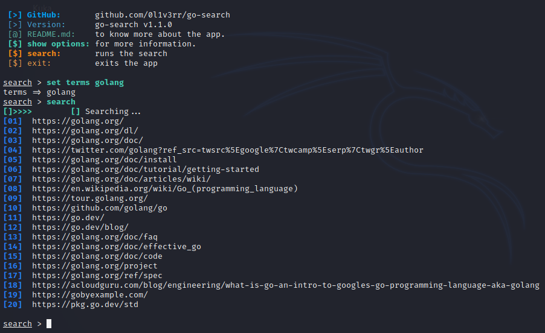

# Go-Search

This is a terminal app that can be used to gather information more effectively using the google search operators.<br>
You can search for specific keywords, file types, websites, etc.<br>
This tool can be used to gather information about a target.<br>
Please do not use this against anybody unless you have specific permission!<br>



<hr>

## Quick Start
- Download Git and Go
### Linux & Mac:
```sh
git clone https://github.com/0l1v3rr/go-search.git
cd go-search
make run
```

### Windows (Only works on Git Bash)
```sh
git clone https://github.com/0l1v3rr/go-search.git
cd go-search
go run cmd/go-search/main.go
```

### Termux
```sh
pkg update -y && pkg upgrade -y
pkg install git
pkg install golang
pkg install make
git clone https://github.com/0l1v3rr/go-search.git
cd go-search
make run
```

<hr>

## Important Commands
- `show options`: Shows the options (see other commands there).
- `search`: Runs the search.
- `search -e`: Runs the search and prints more information.
- `search -f`: Forces the app to run the search without search terms.
- `search -fe`: Forces the app to run the search without search terms and prints more information.
- `reset`: Sets the options to their default values.
- `clear`: Clears the terminal.
- `exit`: Exits the app.